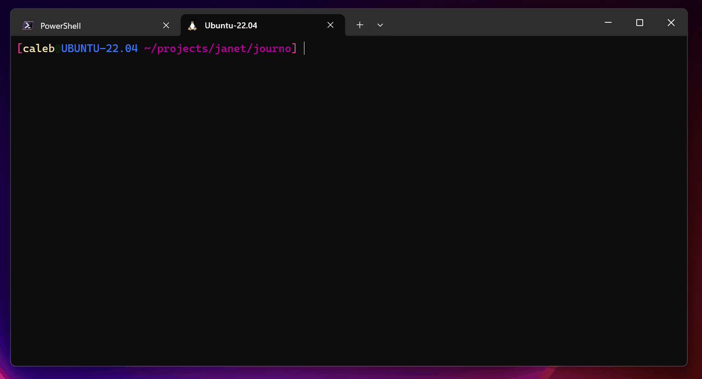

# journo

> ***Journo:*** /ˈdʒɜːnəʊ/ *noun* (plural **journos**)
> - An informal word for journalist.

Journo is a [Janet](https://www.janet-lang.org) library for building interactive, interview-style CLI interfaces.



## Table of Contents
 - [Features](#features)
 - [Getting Started](#getting-started)
 - [API](#api)
 - [Contribution](#contribution)
 - [Prior Art](#prior-art)

## Features

- [x] Nicely formatted interactive question and answer interface
- [x] Several basic question types (`:text`, `:password`, `:select`, `:checkbox`)
- [x] Windows and Linux compatible
- [ ] Ability to customize styles with a `:style` keyword
- [ ] Ability to validate user inputs by passing any predicate function via a `:validate` keyword
- [ ] More question types 
- [ ] Helper functions (at least, if not a fleshed-out API/DSL) for branching question paths based on previously-entered inputs

## Getting Started 

Using Journo is simple: 

- First, define a Question (or list of questions). 
  - A question is a Janet dictionary (i.e. either a [Table](https://janet-lang.org/docs/data_structures/tables.html) or a [Struct](https://janet-lang.org/docs/data_structures/structs.html)) that defines the needed keys (minimally, `:question` and `:type`; if in a list, each question also requires a `:label`).
- Then, pass a single question to `journo/ask` or list of questions to `journo/interview`.
  - These functions will present nicely formatted prompts to the user and return a [table](https://janet-lang.org/docs/data_structures/tables.html) containing their response(s). 

### Installing Journo

With JPM:

```console
$ jpm install https://github.com/CFiggers/journo
```

### Adding Journo to your project

In your `project.janet`:

```janet
(declare-project
  :name "your-project"
  :dependencies ["https://github.com/CFiggers/journo"])
```

Optionally, run `jpm deps` after adding the dependency to your `project.janet` (not needed if you already installed via the instructions above).

In your main file:

```janet
(import journo)

# This will ask a single question and store the response in `answer`.
(def answer (journo/ask 
              {:question "What's your name?"
               :type text}))

# This will ask all three questions and store the responses in `answer`.
(def answers (journo/interview
               [{:label :q1
                 :question "What's the password?"
                 :password}
                {:label :q2
                 :question "Favorite flavor?"
                 :type :select
                 :choices ["Vanilla" "Chocolate" "Strawberry"]}
                {:label :q3
                 :question "Select all that apply"
                 :type :checkbox
                 :choices ["I'm overworked" "I'm underpaid"]}]))
```

To see a quick example in action, run the following command from the journo project root:

```console
$ janet example/example.janet
```

## API

Journo's API is very simple—it exposes two primary macros, each of which is a thin wrapper around a single function (which you're welcome to call directly if you like):

### `(journo/ask)` (macro)

`(journo/ask question &named keywordize)`

Pass a single question to this function to have it asked at the command line. 
  
The question must be a dictionary (table or struct) and contain `:label`, `:question`, and `:type`. `:type` can be one of:
  
 - `:text` or "text" = Open input
 - `:password` or "password" = Open input, replaced with `*` in terminal
 - `:select` or "select" = Single choice (provide with `:choices`)
 - `:checkbox` = Multiple choice (provide with `:choices`)
  
Example: 

```
(journo/ask {:label :q1 :question "Who?" :type :text})
```
       
Returns a single table containing `:question` and ':answer'.

### `(journo/interview)` (macro)

`(journo/interview questions &named keywordize)`

Pass an indexed datastructure of questions to this function to have each one asked in order at the command line. 

Questions must be a dictionary (table or struct) and contain `:label`, `:question`, and `type`. `type` can be one of:

 - `:text` or "text" = Open input
 - `:password` or "password" = Open input, replaced with `*` in terminal
 - `:select` or "select" = Single choice (provide with `:choices`)
 - `:checkbox` = Multiple choice (provide with `:choices`)
  
Example: 
  
```
(journo/interview 
  [{:label :q1 :question "Who?" :type :text} 
   {:label :q2 :question "What?" :type :select 
               :choices ["Me" "Not me"]}])
```
       
Returns a table of user inputs as captured for each question.

### `(journo/interview*)` (function)

`(journo/interview* qs &named keywordize)`

This is the function form of the `journo/ask` and `journo/interview` macros.

Pass either a question or an indexed datastructure of questions to this function to have each one asked in order at the command line. 

Returns a table of user inputs captured for each question.

## Contribution

Comments, concerns, questions, issues, pull requests, code critiques, all are welcome.

## Prior Art

The following libraries do this sort of thing way better and have been doing it for way longer:

- JavaScript
  - [Inquirer.js](https://github.com/SBoudrias/Inquirer.js) 
- Python
  - [PyInquirer](https://github.com/CITGuru/PyInquirer) 
  - [Questionary](https://github.com/tmbo/questionary)

As far as I know, at time of writing there is nothing comparable to this library for Janet (happy to be corrected on that count though).

Enjoy!
